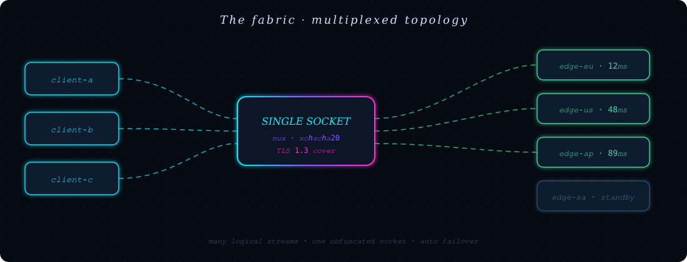
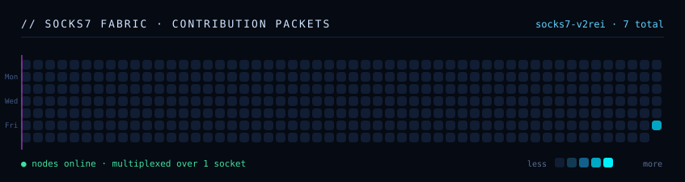
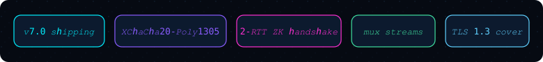

<div align="center">
  
</div>

<div align="center">
  <a href="README.md">EN</a> &nbsp;·&nbsp; <strong>فارسی</strong>
</div>

<br/>

<div align="center">

> **ساکس‌۷ (SOCKS7)** «یک پروکسی دیگر» نیست؛ یک بستر انتقالِ از پایه‌طراحی‌شده است که چندین جریان منطقی را از روی **یک** سوکت مبدل‌شده عبور می‌دهد — با دست‌دادنِ صفر-دانشی در ۲ رفت‌وبرگشت، محرمانگی رو‌به‌جلو و جایگزینی خودکار خروجیِ کم‌تأخیرترین گره.

</div>

<br/>

## ⚡ در حرکت ببین

<div align="center">
  
</div>

<br/>

## 🧬 چرا ساکس‌۷؟

|  | SOCKS5 کلاسیک | **ساکس‌۷** |
|---|---|---|
| جریان در هر اتصال | ۱ | **بی‌نهایت (مالتی‌پلکس)** |
| دست‌دادن | مذاکرهٔ متن‌رو | **صفر-دانشی ۲-RTT** |
| تبادل کلید | ندارد | **X25519 گذرا + PSK** |
| رمزنگاری | ندارد / بیرونی | **XChaCha20-Poly1305** |
| UDP | دشوار | **بومی و درجه‌یک** |
| جایگزینی گره | دستی | **خودکار، کم‌تأخیرترین** |
| اثرانگشت | آشکار | **مبدل‌شده (پوشش TLS 1.3)** |

<br/>

<div align="center">
  
</div>

<br/>

## 🔐 دست‌دادن (Handshake)

<div align="center">
  
</div>

<br/>

## 📡 سنجش زنده

<div align="center">
  
</div>

<br/>

## 🌐 بستر

<div align="center">
  
</div>

<br/>

## 🧰 شروع سریع

```bash
# ۱ · نصب
curl -fsSL https://socks7.dev/install.sh | sh

# ۲ · راه‌اندازی یک گرهٔ لبهٔ محلی
socks7 node --listen :1080 --cipher xchacha20 --obfs tls1.3

# ۳ · هدایت هر کلاینت از میان بستر
socks7 connect --peer edge-1.eu --streams 4
```

```python
from socks7 import Client

with Client("127.0.0.1:1080", streams=8) as c:
    for host in ("api.example.com", "cdn.example.com"):
        c.get(f"https://{host}/")   # مالتی‌پلکس روی یک سوکت
```

<br/>

## 🗺 نقشهٔ راه

```text
[x]  v7.0  هستهٔ انتقال · مالتی‌پلکس · XChaCha20        <- در حال انتشار
[ ]  v7.1  حالت دیتاگرام QUIC · ادامهٔ 0-RTT
[ ]  v7.2  بازار انتقال‌های قابل جای‌گذاری
[ ]  v7.3  آفلود سخت‌افزاری + عبور از کرنل (io_uring)
[ ]  v8.0  KEM هیبرید پسا-کوانتوم (X25519 + Kyber)
```

<br/>

## 🔗 ارتباط

<div align="center">
  
</div>

<div align="center">

[**socks7.dev**](#) &nbsp;·&nbsp; [**مستندات**](#) &nbsp;·&nbsp; [**انتشارها**](#) &nbsp;·&nbsp; [**بحث‌ها**](#)

</div>

<div align="center">
  <sub><code>// بسته‌به‌بسته ساخته‌شده · ساکس‌۷ © ۲۰۲۶</code></sub>
</div>
